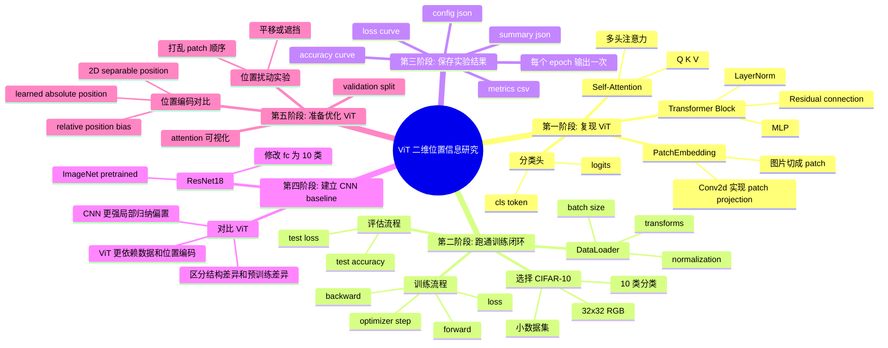

# Development Map

这个文档记录项目从“复现最小 ViT”到“设计后续优化实验”的思考过程。它更像项目思维导图，不是最终论文正文。

## Mermaid 思维导图



## 当前开发脉络

### 1. 先复现 ViT 本身

最开始的目标不是立刻提出优化，而是先把普通 ViT 的结构彻底理解清楚。

这一阶段关注的问题：

- 图片怎么从 `[B, 3, H, W]` 变成 patch token。
- 为什么需要 `cls_token`。
- 位置编码 `pos_embed` 是怎么加到 token 上的。
- Multi-head self-attention 里的 Q、K、V shape 怎么变化。
- Transformer block 为什么使用 residual connection 和 LayerNorm。

这个阶段的核心文件是：

```text
vit.py
```

### 2. 然后选择一个小数据集跑通训练

复现模型之后，遇到的第一个问题是：模型虽然能 forward，但还不知道能不能真的训练。

因此下一步需要数据集。这里选择 CIFAR-10：

- 它是图像分类任务，和 ViT 的使用场景一致。
- 图片是 `32x32` RGB，适合 Mac 上快速训练。
- 类别数是 10，分类头简单。
- 数据量比 ImageNet 小很多，适合 MVP 阶段。

这个阶段的目标不是刷高准确率，而是跑通：

```text
Dataset -> DataLoader -> model(images) -> loss -> backward -> optimizer.step -> evaluate
```

### 3. 训练结果需要保存

跑通训练后，又遇到一个新问题：如果只在终端里打印 loss 和 accuracy，之后很容易忘记某次实验是怎么跑的。

所以加入结果保存：

- `metrics.csv`：每个 epoch 的 train/test loss 和 accuracy。
- `config.json`：本次实验的 batch size、epoch、学习率、模型配置、数据量。
- `summary.json`：最佳 epoch、最佳 test accuracy、最后一轮结果。
- `figures/*.png`：loss 曲线和 accuracy 曲线。

这样以后比较不同模型或位置编码时，可以知道每个结果来自哪一组设置。

### 4. 日志改成每个 epoch 输出一次

一开始训练时 batch 级别输出比较多，信息密度不高。

后来改成每个 epoch 输出一次：

```text
Epoch 1/5
  train loss=... acc=... | test loss=... acc=...
```

这样更适合观察整体训练趋势，也不会被太多 batch 日志干扰。

### 5. 加 CNN baseline

只看 ViT 自己的准确率是不够的，因为不知道它表现好坏到底处在什么水平。

所以加入 ResNet18 CNN baseline：

- CNN 对图像任务很强。
- 卷积天然保留局部空间结构。
- ResNet18 是经典模型，容易作为参照。
- 可以使用 ImageNet 预训练权重，看强 CNN baseline 的表现。

这一步带来的新思考是：如果预训练 ResNet18 明显强于从零训练 ViT，原因可能不只是 CNN 架构更好，也可能是预训练带来的优势。

因此后续比较时可以分成两类：

```text
ResNet18 pretrained vs ViT from scratch
ResNet18 from scratch vs ViT from scratch
```

第一组看强 baseline，第二组更适合比较结构差异。

## 后续实验方向

接下来真正进入论文主题：让 ViT 更好地保留二维位置信息。

可以按这个顺序推进：

1. 加 validation split，避免一直用 test 调参。
2. 先跑稳定 baseline：普通 ViT、ResNet18 from scratch、ResNet18 pretrained。
3. 对比不同位置编码：
   - 当前 learned absolute position embedding。
   - 2D separable position embedding。
   - relative position bias。
4. 做位置扰动实验：
   - 打乱 patch 顺序。
   - 平移图片。
   - 遮挡局部区域。
5. 可视化 attention map，观察模型是否关注合理空间区域。

## 目前项目状态

当前已经完成：

- 最小 ViT 结构。
- CIFAR-10 训练脚本。
- 训练指标和图像保存。
- 实验配置保存。
- ResNet18 CNN baseline。

下一步最适合做：

```text
加入 train / validation / test 划分
```

因为一旦开始比较不同 ViT 优化方案，就不能一直用 test set 做调参依据。
