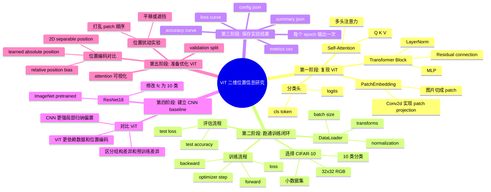

# Development Map

这个文档记录项目从“复现最小 ViT”到“设计后续优化实验”的思考过程。它更像项目思维导图，不是最终论文正文。

## Mermaid 思维导图



## 当前开发脉络

### 1. 先复现 ViT 本身

最开始的目标不是立刻提出优化，而是先把普通 ViT 的结构彻底理解清楚。

这一阶段关注的问题：

- 图片怎么从 `[B, 3, H, W]` 变成 patch token。
- 为什么需要 `cls_token`。
- 位置编码 `pos_embed` 是怎么加到 token 上的。
- Multi-head self-attention 里的 Q、K、V shape 怎么变化。
- Transformer block 为什么使用 residual connection 和 LayerNorm。

这个阶段的核心文件是：

```text
vit.py
```

### 2. 然后选择一个小数据集跑通训练

复现模型之后，遇到的第一个问题是：模型虽然能 forward，但还不知道能不能真的训练。

因此下一步需要数据集。这里选择 CIFAR-10：

- 它是图像分类任务，和 ViT 的使用场景一致。
- 图片是 `32x32` RGB，适合 Mac 上快速训练。
- 类别数是 10，分类头简单。
- 数据量比 ImageNet 小很多，适合 MVP 阶段。

这个阶段的目标不是刷高准确率，而是跑通：

```text
Dataset -> DataLoader -> model(images) -> loss -> backward -> optimizer.step -> evaluate
```

### 3. 训练结果需要保存

跑通训练后，又遇到一个新问题：如果只在终端里打印 loss 和 accuracy，之后很容易忘记某次实验是怎么跑的。

所以加入结果保存：

- `metrics.csv`：每个 epoch 的 train/test loss 和 accuracy。
- `config.json`：本次实验的 batch size、epoch、学习率、模型配置、数据量。
- `summary.json`：最佳 epoch、最佳 test accuracy、最后一轮结果。
- `figures/*.png`：loss 曲线和 accuracy 曲线。

这样以后比较不同模型或位置编码时，可以知道每个结果来自哪一组设置。

### 4. 日志改成每个 epoch 输出一次

一开始训练时 batch 级别输出比较多，信息密度不高。

后来改成每个 epoch 输出一次：

```text
Epoch 1/5
  train loss=... acc=... | test loss=... acc=...
```

这样更适合观察整体训练趋势，也不会被太多 batch 日志干扰。

### 5. 加 CNN baseline

只看 ViT 自己的准确率是不够的，因为不知道它表现好坏到底处在什么水平。

所以加入 ResNet18 CNN baseline：

- CNN 对图像任务很强。
- 卷积天然保留局部空间结构。
- ResNet18 是经典模型，容易作为参照。
- 可以使用 ImageNet 预训练权重，看强 CNN baseline 的表现。

这一步带来的新思考是：如果预训练 ResNet18 明显强于从零训练 ViT，原因可能不只是 CNN 架构更好，也可能是预训练带来的优势。

因此后续比较时可以分成两类：

```text
ResNet18 pretrained vs ViT from scratch
ResNet18 from scratch vs ViT from scratch
```

第一组看强 baseline，第二组更适合比较结构差异。

## 后续实验方向

接下来真正进入论文主题：让 ViT 更好地保留二维位置信息。

可以按这个顺序推进：

1. 加 validation split，避免一直用 test 调参。
2. 先跑稳定 baseline：普通 ViT、ResNet18 from scratch、ResNet18 pretrained。
3. 对比不同位置编码：
   - 当前 learned absolute position embedding。
   - 2D separable position embedding。
   - relative position bias。
4. 做位置扰动实验：
   - 打乱 patch 顺序。
   - 平移图片。
   - 遮挡局部区域。
5. 可视化 attention map，观察模型是否关注合理空间区域。

## 目前项目状态

当前已经完成：

- 最小 ViT 结构。
- CIFAR-10 训练脚本。
- 训练指标和图像保存。
- 实验配置保存。
- ResNet18 CNN baseline。
- train / validation / test 实验协议。
- early stopping 和 validation-based checkpoint selection。
- confusion matrix、macro metrics 和 best checkpoint 保存。
- 基础 RoPE 变体，并与原始 ViT baseline 分离。
- weekly comparison report / PPT 生成层。

下一步最适合做：

```text
先清理当前训练入口与文档之间的不一致，再跑 ViT baseline vs ViT + RoPE 的干净对比
```

因为当前 `README.md` 和本路线图提到了 `train_cifar10_experiment.py`，
但工作区暂时没有这个文件。继续研究前，应该先确认统一入口到底是缺失、
尚未同步，还是已经被当前两个专用训练脚本取代。

这个同步问题已记录在 `docs/PROJECT_LOG.md`。
## Reporting Layer

周会汇报现在不应该被当成“一次性画图脚本”，而应该被当成可复用的工程层。

理想的数据流是：

- inputs: per-run CSV metrics, config JSON, summary JSON
- analysis layer: compare shared metrics and summarize config differences
- presentation layer: turn those outputs into meeting-ready PPT content

这样做的原因是，后面的实验一定会出现：

- 更多模型变体
- 更多指标
- 更多对比关系

如果分析层和展示层不分开，后面会越来越乱。

英文可以记一句：
`Analysis artifacts and presentation should be loosely coupled.`

## Methodology Cleanup

在真正进入结构改动之前，训练协议必须先变得更规范。

目前已经完成的清理步骤是：

1. early stopping support
2. validation-based model selection
3. richer selected-checkpoint evaluation outputs

这些步骤本身不是论文创新点，但它们很重要，因为它们决定了后面结构实验是否可信。

也可以理解成：

- 这些是 `research infrastructure`
- 不是 `research contribution`

## Current Experimental Contract

当前项目已经建立起一套比较稳定的实验协议：

- `train` split for optimization
- `validation` split for checkpoint selection
- `test` split for final reporting
- selected checkpoint metrics saved to disk
- confusion matrix and macro metrics included in the result artifacts

后面不管你做 `RoPE`、`2D RoPE`，还是加别的图像归纳偏置，最好都沿用这套协议。
这样后续对比才有可比性。

## Baseline Boundary Cleanup

另一个关键清理动作，是把原始 baseline 和后续结构变体分开。

现在的边界是：

- `vit.py` = original ViT baseline
- `vit_rope.py` = basic RoPE reproduction baseline
- `train_cifar10.py` chooses between `baseline` and `rope`

为什么这一步重要：

- baseline 可以长期稳定
- 每个结构改动都变成显式、可追踪的分支
- 后面加 `2D RoPE`、`RoPE + locality bias`、甚至更远一点的图像偏置时，都不会把 baseline 文件污染掉

## Immediate Research Path

接下来真正进入研究主线时，路径应该保持递进，不要一下子把很多东西混在一起。

1. run clean `ViT baseline` vs `ViT + RoPE`
2. confirm the implementation is stable and compare curves / macro metrics
3. extend the current RoPE branch into a light `2D RoPE`
4. compare `vit_baseline` / `vit_rope` / `vit_rope_2d`
5. repeat the comparison across multiple seeds
6. only after that consider adding one lightweight image bias, such as locality
   or relative position ideas

这样做的好处是，论文叙事会非常清楚：

- baseline 是什么
- 第一层结构改动是什么
- 它有没有带来收益
- 如果有，再继续做第二层图像归纳偏置

这会比一开始就直接做一个 `RoPE + Swin-style idea + 其他 trick` 的混合模型，更容易讲清楚，也更容易写成 clean ablation。

## Unified Runner Step

随着模型变体开始增加，项目需要一个更统一的实验入口。

如果继续沿用：

- 一个模型一个训练脚本
- 一个变体一个新的 `main`

那么后面很容易出现：

- 参数接口不一致
- 默认超参数不一致
- 结果文件格式虽然类似，但入口逻辑越来越分散

所以现在新增统一入口 `train_cifar10_experiment.py` 是一个合理的工程步骤。

它的角色不是取代所有旧脚本，而是：

- 为后续实验提供统一命令接口
- 把模型选择变成显式参数
- 让后续新模型更像“注册新分支”，而不是“再复制一个训练脚本”

这属于很典型的 `research infrastructure` 优化：
它不会直接提升分数，但会显著降低后续做 ablation 的混乱度。

## Registry-Style Extension Rule

统一入口现在进一步收成了“注册表模式”。

这一步的核心思想是：

- 把训练主循环固定下来
- 把模型差异压缩到一个明确的注册区块里

这样后面每次新增模型时，你不需要再决定：

- 要不要复制一个新的训练脚本
- 要不要复制一份 early stopping 逻辑
- 要不要重新写一份结果保存逻辑

你只需要决定：

1. 这个模型文件叫什么
2. 它的 model builder 是什么
3. 它是否需要专门的 dataloader
4. 它的默认超参数和元信息是什么

这会让后续 `2D RoPE`、`RoPE + locality bias`、甚至别的 ViT 变体，
都能作为“注册一个新分支”来接入，而不是继续扩散训练入口。

## One Runner Architecture

项目现在已经从“多个训练脚本并存”收成了更干净的结构：

- `train_cifar10_experiment.py` 作为唯一正式训练入口
- `experiment_utils.py` 承担共享训练循环与评估保存逻辑
- `cifar10_data.py` 承担数据构建逻辑
- `model_registry.py` 承担模型注册与默认配置逻辑

目前这个统一结构已经可以自然承接下面这条研究主线：

- `vit_baseline`
- `vit_rope`
- `vit_rope_2d`
- `resnet18_scratch`

这里 `resnet18_scratch` 是当前主要 CNN 对照，
`resnet18_imagenet` 继续保留，但暂时不作为近期主实验表的一部分。

在当前阶段，真正应该优先自动化的是：

- multiple seeds
- one report per seed
- then summary/mean-std analysis

而不是立刻继续堆更多训练 trick。

这一步很重要，因为论文后面真正需要引用的通常不是：

- 单个 seed 的最好截图

而是：

- multi-seed mean/std
- whether the ranking is stable
- whether gains are larger than random fluctuation

这一步的意义是：

- 训练协议只维护一份
- 实验入口只维护一份
- 模型差异被限制在注册表层

这能让后续的研究重点更集中在“结构改动本身”，而不是继续花时间维护分散的训练脚本。

## Reporting For Unified Models

随着统一实验入口已经支持：

- `vit_baseline`
- `vit_rope`
- `vit_rope_2d`
- `resnet18_scratch`
- `resnet18_imagenet`

汇报层也需要同步升级，否则会出现一个常见问题：

- 训练层已经在用统一模型命名
- 但报告层还在靠旧脚本时代的 run name 和零散字段猜模型

这会直接影响组会叙事质量，因为你真正想讲的是：

- baseline vs rope
- rope vs 2D rope
- vit vs cnn
- scratch vs pretrained

而不是：

- 某个时间戳 run 和另一个时间戳 run 的对比

因此 reporting layer 的合理方向是：

1. 优先读取结构化模型元信息
2. 自动识别对比场景
3. 先生成 analysis context
4. 再让 PPT layer 只负责排版

这样后面如果再注册新模型分支，报告层的扩展点会更清楚：

- add metadata inference
- add scenario narrative if needed
- reuse the existing table / chart / slide layout logic

这依然属于 `research infrastructure`，但它对周会和论文写作都很重要，
因为它决定了实验结果能不能被稳定、清楚地讲出来。

## Explicit Scratch ResNet18 Entry

为了让 CNN 对照实验更清楚，现在额外加入一个显式入口：

```text
train_resnet18_scratch_cifar10.py
```

它的意义不是新增一套训练逻辑，而是把“ResNet18 不加载预训练权重”变成一个不会误用的命令入口。

为什么这一步有用：

- `train_cnn_cifar10.py --weights none` 已经能做到 scratch 训练，但容易忘参数。
- 单独入口让实验命名更清楚：scratch baseline 就是 scratch baseline。
- 后续比较 `ResNet18 scratch`、`ResNet18 ImageNet pretrained`、`ViT baseline` 时，命令层面更不容易混淆。
- 两台电脑协作时，Codex 看到文件名就能理解这个实验分支的意图。

这个改动属于 `experiment hygiene`，目标是减少实验入口的歧义。
